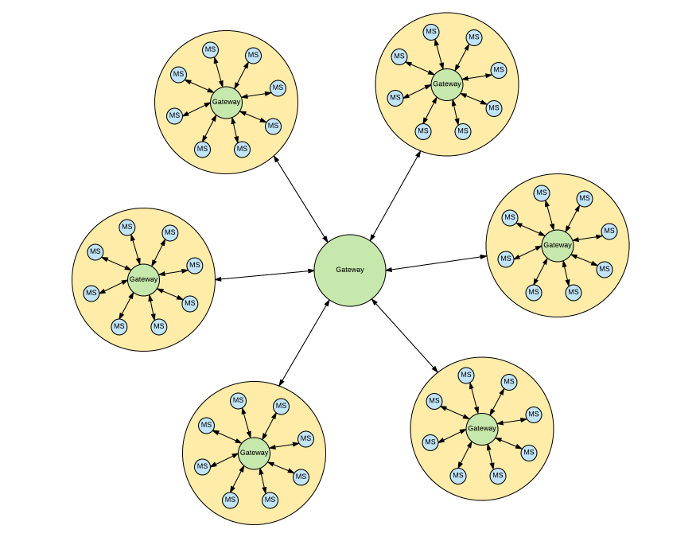

# Floret.js
## A reactive microservice framework

*floret - Noun: one of the small flowers making up a composite flower head.* 

## Description
Floret is a lightweight microservice framework.  Its event-driven architecture facilitates the orchestration
of services to produce desired outcomes.  Each Floret service has a small scope of responsibility,
and communicate directly with other Floret services via their REST APIs or with a built-in Pub/Sub system.

Typical uses:

* Abstraction of service implementations
* Tighly scoped API services
* Connector services binding services together
* Simple event handlers and emitters

## Floret Ecosystem
Floret services are event driven, publishing and subscribing to event data via a central API Gateway.  The illustration
below is an example of a floret.  Each floret service provide specific functionality.

## Examples
Refer to the [floret-examples](https://stash.acxiom.com/projects/ACXM/repos/floret-examples/browse) repository for
working examples of use.

## Installation
Floret is a node module, and is installed to your project via npm or similar package manager.  

npm install --save git+ssh://git@stash.acxiom.com:7999/acxm/floret.git#develop

## Contributing

Contributions are made to this project by following [IT Open Source Standards](https://stash.acxiom.com/projects/AT/repos/it-development-standards/browse/docs/coding-standards/index.md)

## Reporting Issues

## Known Issues
