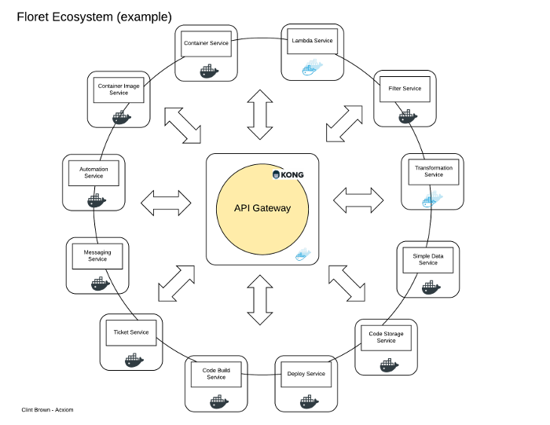

# Floret.js 

###  A microservice framework for node

*floret - Noun: one of the small flowers making up a composite flower head.* 

Floret is a lightweight microservice api framework.  With Floret, consistent and  
connected RESTful services leverage event-based messaging to choreograph workloads.
Floret services communicate through an API Gateway.

### Floret.js is great for

* RESTful APIs
* Web Applications
* Existing Service and API proxies
* Webhooks
* Lambda
* Self-healing strategies
* Notify and forget strategies
* Data transformations
* Asynchronous service processes

### Rapid service development
Enjoy standing up deployable services in minutes. With just a few lines of code your service
will:

* self-register with the api gateway
* create healthcheck and new subscriber apis at the gateway and web server
* automatically generate Open API spec
* discover channels and their subscribers
* discover subscriptions to other floret services
* create an admin api for managing pub/sub operations

### Getting started with Floret
Use [this guide](docs/getting-started.md) to get up and running with Floret.

### Installation
Make sure you've read the getting started (see above) and your environment is created. Floret is a node module, and is installed to your project via npm or similar package manager.  

#### Creating a floret service
Create a floret configuration file for your service or application
    
floret.json

    const floretConfig = {  
        "gatewayHost": "http://foo.gw.net", // api gateway host url  
        "gatewayProxyPort": 8000, // proxy port for service requests  
        "gatewayAdminPort": 8001, // api gateway administration api  
        "serviceName": "example-service", // floret service name  
        "serviceHost": "http://foo.service.net", // floret service url  
        "servicePort": 8084, // floret service port  
        "serviceURI": "/example-service" // floret service base uri  
    }  

index.js

    const fs = require('fs');
    const Floret = require('floret');  
    
    const floretConfig = JSON.parse(fs.readFileSync('floret.json', 'utf8'));
    const floret = new Floret(floretConfig);  

    floret.listen( ()=>{  
        console.log(`Floret Service started on port ${floret.port}`;  
    });  

#### Floret Class Spec
See here for [floret methods](/docs/jsdoc-index.md)

#### Custom APIs
Add custom API endpoints to the built-in floret http server.

app/routes/routes.js

    module.exports = (app) => {
        app.router.get('/hello-world', async(ctx, next) => {
            ctx.body = "Hello World";
        });
        
        app.router.post('/hello-world', async(ctx, next) => {
            console.log('Incoming message to /hello-world');
            console.log(ctx.body);
        });
    }
    
    // index.js
    ...
    const floret = new Floret(floretConfig);
    ...
    // include any apis (routes) your web api will serve
    const routes = require('./app/routes/routes')(floret);
    
    floret.listen(() => {
        // make your api public by registering it at the gateway
        floret.registerAPI(`hello-world`, '/hello-world', 'GET,POST').then( (res) => {
            console.log('api hello-world created at the api gateway');
        })
    });
    

### Pub/Sub
Floret has a built-in pub/sub model for event-driven communication with other floret services.  
Publishers emit messages on subscribable channels.  A subscription to a channel in effect means 
that the published messages will be POSTed to the subscriber-provided api endpoint.

Subscriptions can be created dynamically after both the Publisher and Subscriber services are active.  

#### Channels
Messages are published to channels, and channels can be subscribed to.  Channels can be  
defined statically or dynamically.

##### Static Channel
    const soapboxConfig = {
        "name": "soapbox",
        "description": "a channel for rants",
        "hostURL": floretConfig.serviceHost,
        "hostPort": floretConfig.servicePort,
        "uri": "/soapbox"
    };
    
    ...
    let soapboxChannel = new floret.Channel(soapboxConfig);
    floret.channels = [soapboxChannel];
    floret.listen(()=>{});
    ...
    
##### Dynamic Channel
    // create new channels under the /rooms/ uri
    floret.router.post('/rooms/:channel', async (ctx, next) => {
        let channelName = ctx.params.channel;
        let channel = app.channels[channelName];

        if (!channel){
            let newChannel = new floret.Channel({
                "name": room,
                "description": "general topics",
                "endpoint": `${floret.url}/rooms/${channel}`,
                "serviceName": floret.name,
                "hostURL": floret.host,
                "hostPort": floret.url,
                "uri": "/rooms/" + channelName
            });
            
            await app.addChannel(newChannel);
        }
    });

#### Subscriptions
Similar to a webhook, a subscription is the configured landing spot for incoming service messages.

##### Create a new subscription with multiple handlers
    
    ...
    const floret = new Floret(floretConfig);
    
    // creates a new handler function    
    let fooHandler = (ctx) => {
        let pkg = new floret.Package(ctx.body);
        console.log('received message: ' + JSON.stringify(pkg.payload))
    });
    
    let barHandler = (ctx) => {
        let pkg = new floret.Package(ctx.body);
        console.log('received message: ' + JSON.stringify(pkg.payload))
    });
    
    // create a subscription object    
    let bazSubscription = new floret.Subscription('fooSubscription', floret.service, floret.router, floret.gateway);
    
    // attach 1 or more handler functions to the subscription event 
    bazSubscription.observable.subscribe(fooHandler);
    bazSubscription.observable.subscribe(barHandler);
    
    // add to array of subscriptions, which will be invoked during floret initialization
    floret.addSubscription(bazSubscription);
    ...

##### Subscribe to a Floret Service by name and channel
    ...
    floret.listen().then(() =>{
        // subscribe to a service once floret is up.  specify a subscription
        let subscriberId = floret.subscribe('baz', 'bazChannel', bazSubscription);
    })

##### Subscribe a Floret Service to another via the REST API
    
    POST http://api-gateway:8000/baz/subscribe/
    Content-Type application/json
    body:
    {
        "name": "example-service",
        "url": "http://192.168.1.158:8084/example-service/subscription/bazSubscription",
        "channel": "bazChannel"
    }
    
##### Unsubscribe from a Floret Service 
    ...
    floret.unsubscribe('baz', 'bazChannel', subscriberId);
    
##### Unsubscribe a Floret Service from another via the REST API

    POST http://api-gateway:8000/baz/unsubscribe/
    Content-Type application/json
    body:
    {
        "channelName": "baz",
        "url": "http://192.168.1.158:8084/example-service/subscription/bazSubscription",
        "channel": "bazChannel"
    }

#### Channel and Subscriber discovery process

When a floret service stands up, an immediate survey of the api gateway occurs.  It immediately discovers  
all of its channels registered at the gateway, and builds any it has not already created. When a new channel  
is created, subscribers of each channel are discovered.  They are attached and become observers of the channel.  

Self-discovery of channels and subscribers allows horizontal scaling of floret services that stand up and  
become aware of the services current state.    

### Documentation

Floret creates an Open API spec for your api at bootstrap.  It exposes a /api-spec.json resource, and this url can be
used by consuming applications.  One such application may be Swagger UI, which is deployed as a floret core service called
api-doc.  Upon standing up, a notification of new documentation is sent to api-doc, which in turn hosts the spec.

#### Documenting Custom APIs

If you added custom apis with your service, you'll want to document them in the Open API spec.  To do so, just add annotations
above your api like this:

    /**
     * @swagger
     * /test/it/out:
     *   get:
     *     description: test doc
     *     responses:
     *       200:
     *         description: bar bang
     *     tags: [pulse]
     */
    floret.router.get('/test/it/out', (ctx) => {
        console.log('test/it/out')
    })

Once your documentation is registered with floret api-doc service, it will appear in swagger ui.

## Core libraries
Floret is built upon [KOA](https://github.com/koajs/koa).  KOA provides the http middleware framework for writing web applications and apis.
Floret uses reactive programming concepts to handle observable incoming events.  See [rxjs](http://reactivex.io/rxjs/) for more details.

## Floret Ecosystem
Floret services are event driven, publishing and subscribing to event data via a central API Gateway.  The illustration  
below is an example of a floret.  Each floret service provide specific functionality.

## Examples
You can find full example projects at [floret-examples](tbd).

## Authors
[clint brown - clint.brown.atx@gmail.com](mailto:clint.brown.atx@gmail.com) | [github - cbrown23](https://github.com/cbrown23)